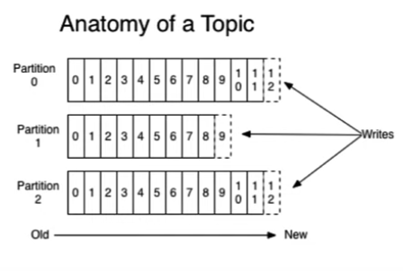
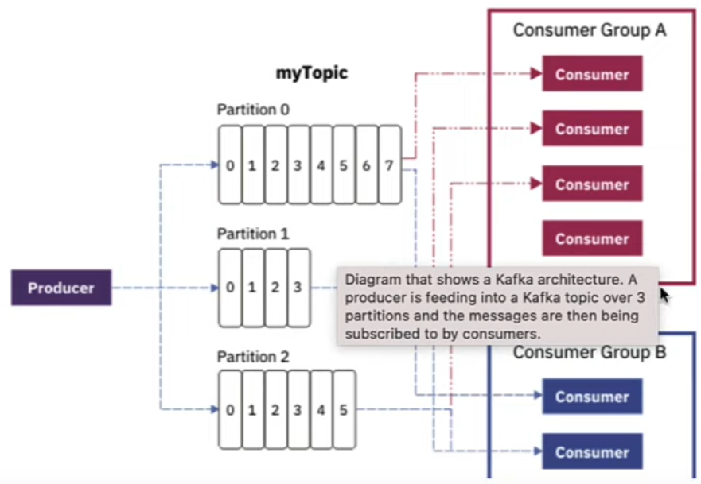

# Apache Kafka -- Javaguides course

To handle communication between multiple microservices as a messaging system.

Multiple microservices can send and consume messsages to and from the kafka broker.

The zookeeper maintains the state of all of the kafka clusters - as well as the configuration of all the topics, producers, and consumers;

Kafka is fault tolerant: if one node or broke goes down, it can still manage other brokers (and the entire cluster);

## Kafka cluster

Kafka is a distributed system, thus it acts as a cluster;

a cluster has a minimum of 3 brokers.

### Kafka broker

Kafka broker is the Kafka server. Broker is just a meaningful name given to the Kafka server.

Producer and consumer do not interact directly. Kafka server intermediates the messages sent amongst them.

### Kafka producer

Prodeucer is an applicaion that sends messages. The messages are sent to the Kafka broker/server. 

### Kafka consumer

Consumer is an application that reads messages from the Kafka server.

Producers will send messages to the Kafka server and consumers will request/read them. 

### Kafka topic

Producers send data to the broker. Consumers ask for data from the broker. The question is, which data?

The broker is filled with messages, so that an identification mechanism is required to request data from a broker.

There comes the notion of topics.

* Topic is like a table in database or folder in a file system;
* Topic is identified by a name;
* You can have any number of topics;

### Kafka partitions

Topics are divided into a number of partitions, which contain records in an unchangeable sequence;

Kafka broekers will store messages for a topic, but the capacity of data can be enormous and it may not be possible to store it all in a single computer.

Once Kafka is a distributed system, the data will be partitioned into multiple partes and distributed among multiple computers.

One topic (table in database) has multiple partitions.

### Offsets

Offset is a sequence of ids given to messages as they arrive at a partition.

Once the offset is assigned it will never be changed.

The first message gets an offset zero. The next one receives one and so on.

### Consumer Groups

A consumer group contains one or more consumers working together to process the messages.

## Spring Boot Framework and Kafka

Spring boot simplifies Kafka producer and consumer configuration via autoconfiguration. 

We do not have to write Java configuration code to configure Kafka.

We can check its spring documentation at https://docs.spring.io/spring-kafka/reference/html/.

Without spring boot there is lots of boilerplate configuration code to be written.

We configure Kafka broker in our application.properties file.

## Kafka Producer and Consumer for JSON Serializer and Deserializer

Apache Kafka stores and transports byte[].

There is a number of built-in serializers and deserializers but none of them supports JSON.

Spring Kafka created a JsonSerializer and JsonDeserializer that can be used to convert Java Objects to and from JSON.

We configure it in the applications.properties file -- value serializer and deserializer.
